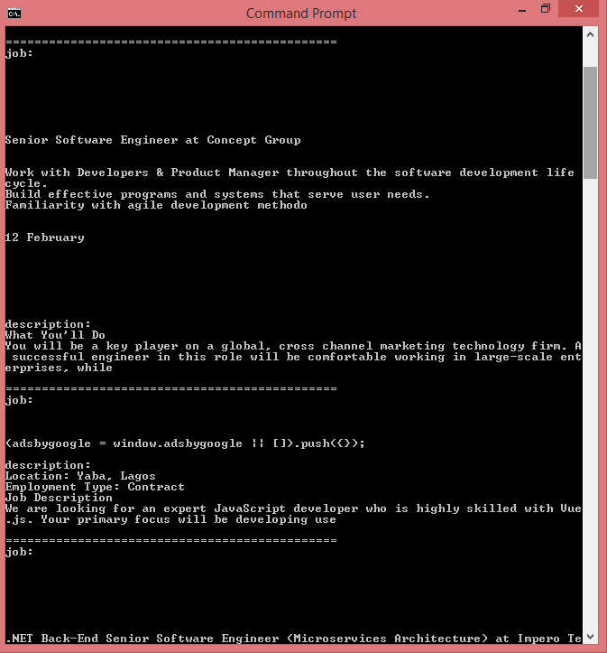

# Web Scraper

This is an application designed to simplify the process of retrieving data from specified websites. It scrapes desired information off web pages by parsing the HTML content of the pages.

In this case, Myjobmag was used as the designated website where specific data is to retrieved. The scraper has been designed to focus on job listings in Nigeria.

The following are the specific data this application has been designed to retrieve from Myjobmag.
- Job title.
- Job description.


These are vital information are for personal used. The information provided are in real time which gets updated as new listings are added to the website.

## Tools and Technologies
### Ruby
The project was built completely using Ruby.

### Nokogiri
Nokogiri is an open source software library to parse HTML and XML in Ruby. It depends on libxml2 and libxslt to provide its functionality.

### Prerequisites

- Ruby
- Terminal

### Set Up

- Go to the "Code" section of this repository and press the green button that says "Code". Copy the URL or the SSH key.
- Go to the terminal and enter:
```
git clone URL/SSH key
```
- If you don't have git you can download this project and unzip it.
- Change directory into the folder the application is saved.
- To install the gems, run:
```
bundle install
```
- From the root directory(RUBY-BOT), change directory into the bin directory by running the following to get the above specified data in real time:
```
ruby bin/main.rb
```
- The data is now yours to do as you like.

## Author

George Gbenle

- GitHub: [ccobasi](https://github.com/ccobasi)
- twitter: [@ObasiChux](https://twitter.com/ChukwumaObasi)
- linkedIn: [@Chukwuma Obasi](https://www.linkedin.com/in/chukwuma-obasi/)


## Contributing

Contributions, issues, and feature requests are welcome!


Feel free to check the issues page: https://github.com/ccobasi/ruby-bot/issues

### Show your support

Give a ⭐️ if you like this project!

### License

This project is [MIT](./LICENSE) licensed.
